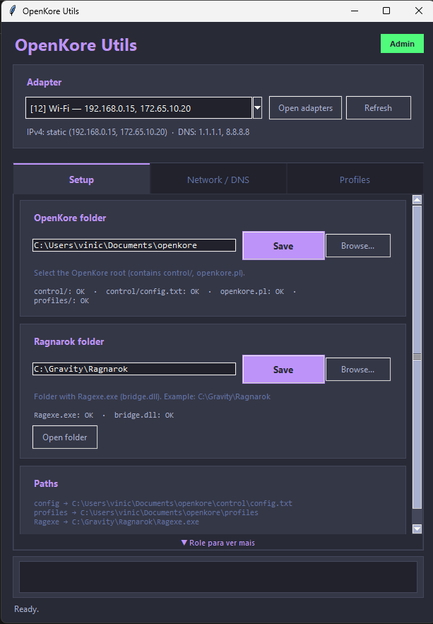
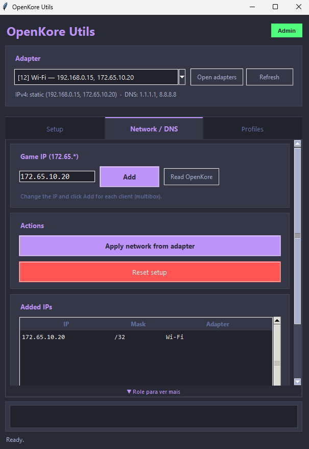
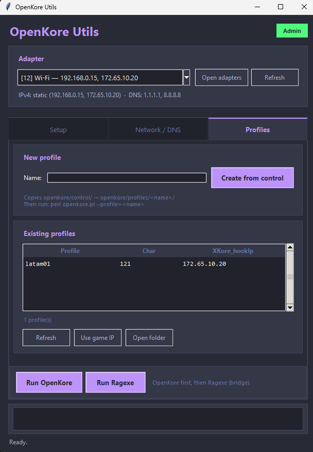

# Guia de uso — OpenKore Utils

Passo a passo para configurar a rede do **OpenKore** no **latamRO** com **XKore 1 + bridge** (login pelo cliente Ragexe, não pelo OpenKore).

---

## Índice

1. [O que este programa faz](#1-o-que-este-programa-faz)
2. [Requisitos](#2-requisitos)
3. [Instalação](#3-instalação)
4. [Primeira execução](#4-primeira-execução)
5. [Aba Setup — pastas](#5-aba-setup--pastas)
6. [Aba Network / DNS — rede](#6-aba-network--dns--rede)
7. [Aba Profiles — perfis e execução](#7-aba-profiles--perfis-e-execução)
8. [Fluxo completo (primeira vez)](#8-fluxo-completo-primeira-vez)
9. [Rotina do dia a dia](#9-rotina-do-dia-a-dia)
10. [Multibox (vários bots)](#10-multibox-vários-bots)
11. [Encerrar e restaurar a rede](#11-encerrar-e-restaurar-a-rede)
12. [Problemas comuns](#12-problemas-comuns)
13. [Arquivos de configuração](#13-arquivos-de-configuração)

---

## 1. O que este programa faz

O **OpenKore Utils** automatiza a parte chata da rede para jogar com OpenKore no latamRO:

| Tarefa | O que o app faz |
|--------|-----------------|
| IP fixo na LAN | Lê o IP/gateway do adaptador e aplica IPv4 estático |
| DNS | Define Cloudflare (`1.1.1.1`) + Google (`8.8.8.8`) |
| IP do jogo (`172.65.*`) | Adiciona o IP Cloudflare na placa de rede (whitelist) |
| Perfis OpenKore | Lista, cria e abre pastas em `openkore/profiles/` |
| Lançamento | Botões para **Run OpenKore** e **Run Ragexe** com o perfil certo |

**Modo suportado:** XKore 1 + `bridge.dll` — o OpenKore fica em espera e o **Ragexe** conecta nele.

---

## 2. Requisitos

- **Windows 10 ou 11**
- Executar como **Administrador** (obrigatório para mudar IP/DNS)
- **OpenKore** instalado (pasta com `openkore.pl`, `control/`, `profiles/`)
- **Ragnarok latam** com `Ragexe.exe` e `bridge.dll` na pasta do jogo
- **Perl** no PATH (Strawberry Perl) — necessário para o botão *Run OpenKore*
- Adaptador de rede ativo (Wi-Fi ou Ethernet)

---

## 3. Instalação

### Opção A — Baixar o `.exe` (releases)

1. Baixe `OpenKoreUtils.exe` da página de releases do repositório.
2. Coloque em qualquer pasta (ex.: `C:\Tools\OpenKoreUtils\`).
3. Na primeira execução o app cria `openkore_utils_config.json` **ao lado do exe**.

### Opção B — Clonar e compilar

```bat
git clone https://github.com/viniciuslgagliardi-prog/openkore-utils.git
cd openkore-utils
scripts\build.bat
```

O executável sai na raiz do projeto: `OpenKoreUtils.exe`.

### Opção C — Rodar em desenvolvimento

```bat
cd openkore-utils\src
py -3 -m openkore_utils
```

---

## 4. Primeira execução



1. **Clique com o botão direito** em `OpenKoreUtils.exe` → **Executar como administrador**.
2. No canto superior direito deve aparecer o badge verde **Admin**.
   - Se aparecer **Run as admin** (laranja), clique nele para reiniciar elevado.
3. O app carrega o adaptador de rede e cria/atualiza o arquivo de config local.

> **Config local:** `openkore_utils_config.json` fica na mesma pasta do `.exe`. Não vai para o Git — guarda seus paths, IPs e adaptador escolhido.

---

## 5. Aba Setup — pastas

Configure **uma vez** (ou quando mudar de PC/pasta).

### OpenKore folder

1. Aba **Setup**.
2. Em **OpenKore folder**, clique **Browse...** e selecione a **raiz** do OpenKore.
   - Deve conter: `control/`, `openkore.pl`, e idealmente `profiles/`.
   - **Não** selecione `Downloads` nem subpastas aleatórias.
3. Clique **Save**.
4. Confira os checks abaixo do campo:
   - `control/` · `control/config.txt` · `openkore.pl` · `profiles/` → todos **OK**.

### Ragnarok folder

1. Em **Ragnarok folder**, selecione a pasta do jogo (ex.: `C:\Gravity\Ragnarok`).
2. Clique **Save**.
3. Confira: `Ragexe.exe` e `bridge.dll` → **OK**.
4. **Open folder** abre o Explorer nessa pasta (útil para copiar `bridge.dll`).

### Paths (resumo)

A seção **Paths** mostra onde o app vai ler/escrever:

- `config` → `...\openkore\control\config.txt`
- `profiles` → `...\openkore\profiles\`
- `Ragexe` → `...\Ragnarok\Ragexe.exe`

---

## 6. Aba Network / DNS — rede



### Entenda os IPs

| IP | Função |
|----|--------|
| `192.168.x.x` (ou similar) | Seu IP **real na rede local** (LAN) — internet, roteador |
| `172.65.x.x` | IP **Cloudflare / latamRO** — o jogo e o XKore usam este |

O OpenKore precisa dos dois: LAN para navegar e `172.65.*` para o cliente enxergar o servidor via whitelist.

### Passo a passo — configurar a rede

1. No topo da janela, escolha o **Adapter** (Wi-Fi ou Ethernet).
   - A linha abaixo mostra IPv4 e DNS atuais.
   - **Refresh** atualiza a lista; **Open adapters** abre o painel do Windows.
2. Aba **Network / DNS**.
3. **Apply network from adapter**
   - Aplica IP estático + gateway lidos do adaptador.
   - Define DNS `1.1.1.1` e `8.8.8.8`.
   - Requer **Admin**.
4. Em **Game IP (172.65.\*)**, confira o IP (ex.: `172.65.10.20`).
   - **Read OpenKore** lê `XKore_hookIp` do `control/config.txt` ou do perfil.
5. Clique **Add** para colocar o `172.65.*` na placa.
   - Na primeira vez, aplica rede + IP do jogo.
   - Nas próximas, só adiciona outro `172.65.*` se for multibox.
6. Verifique em **Added IPs** se o IP aparece na lista.

### Botões úteis

| Botão | Ação |
|-------|------|
| **Apply network from adapter** | IP LAN estático + DNS |
| **Add** | Adiciona IP `172.65.*` |
| **Read OpenKore** | Copia `XKore_hookIp` para o campo |
| **Remove selected / Remove all** | Remove IPs `172.65.*` da placa |
| **Reset setup** | Remove IPs do jogo, limpa hosts, volta DHCP nos adaptadores afetados |

---

## 7. Aba Profiles — perfis e execução



### Criar um perfil novo

1. Aba **Profiles**.
2. Em **Name**, digite um nome (ex.: `latam01`) — letras, números, `_`, `-`, `.`.
3. **Create from control** copia tudo de `openkore/control/` para `openkore/profiles/<nome>/`.
4. Edite o `config.txt` do perfil se precisar (`char`, `XKore_hookIp`, etc.).

### Lista de perfis

A tabela mostra:

| Coluna | Significado |
|--------|-------------|
| **Profile** | Nome da pasta em `profiles/` |
| **Char** | Slot `char` do `config.txt` |
| **XKore_hookIp** | IP `172.65.*` que o Ragexe vai usar |

Selecione uma linha antes de usar os botões abaixo.

| Botão | Ação |
|-------|------|
| **Refresh** | Recarrega a lista |
| **Use game IP** | Copia o `XKore_hookIp` do perfil para a aba Network |
| **Open folder** | Abre `profiles/<nome>/` no Explorer |

### Rodar OpenKore + jogo

Na **barra fixa inferior** da aba Profiles (sempre visível):

1. Selecione o perfil na tabela.
2. **Run OpenKore** — abre console com `perl openkore.pl --profile=<nome>`.
3. Espere o OpenKore ficar online (mensagem de XKore na porta, ex. `2350`).
4. **Run Ragexe** — inicia `Ragexe.exe 1rag1 -ip <XKore_hookIp> -port 2350`.
5. **Faça login manualmente** no cliente do jogo.

> Ordem: **OpenKore primeiro**, depois **Ragexe**. O bridge conecta o cliente ao bot.

---

## 8. Fluxo completo (primeira vez)

Checklist do zero até o personagem online:

```
[ ] 1. Instalar OpenKore + Perl + pasta do Ragnarok com bridge.dll
[ ] 2. Abrir OpenKoreUtils.exe como Administrador
[ ] 3. Setup → apontar pastas OpenKore e Ragnarok → Save
[ ] 4. Selecionar adaptador Wi-Fi/Ethernet no topo
[ ] 5. Network → Apply network from adapter
[ ] 6. Network → conferir XKore_hookIp → Add
[ ] 7. Profiles → criar perfil (ou usar um existente)
[ ] 8. Ajustar config.txt do perfil (char, hook IP, etc.)
[ ] 9. Profiles → selecionar perfil → Run OpenKore
[ ] 10. Profiles → Run Ragexe → login no jogo
```

---

## 9. Rotina do dia a dia

Depois da configuração inicial, o fluxo encurta:

1. Abrir **OpenKoreUtils** como admin (se a rede foi resetada).
2. Conferir adaptador e IPs em **Network / DNS** (ou **Apply** se voltou DHCP).
3. **Profiles** → selecionar perfil → **Run OpenKore** → **Run Ragexe**.
4. Jogar.

Não é necessário recriar perfil nem refazer Setup a cada sessão, salvo se mudar pasta ou PC.

---

## 10. Multibox (vários bots)

Cada bot precisa de um **IP `172.65.*` diferente** na mesma placa (ex.: `.20`, `.21`, `.22`).

1. Crie um **perfil** por personagem (`latam01`, `latam02`, …).
2. Em cada `profiles/<nome>/config.txt`, defina `XKore_hookIp` único.
3. Na aba **Network / DNS**, adicione cada IP com **Add**.
4. Para jogar: selecione o perfil → Run OpenKore → Run Ragexe (um par por vez).

**Limitações conhecidas:**

- Vários Ragexe na **mesma pasta** com `bridge.dll` pode dar conflito com GameGuard.
- Multibox estável costuma exigir **pastas separadas** do jogo ou um bot por vez.
- A porta XKore (`2350`) pode ser a mesma se os `hookIp` forem diferentes.

---

## 11. Encerrar e restaurar a rede

Quando terminar de jogar ou for usar o PC em outra rede:

1. Aba **Network / DNS**.
2. **Reset setup**
   - Remove IPs `172.65.*` dos adaptadores.
   - Restaura **DHCP** (IP e DNS automáticos).
   - Limpa entradas relacionadas no `hosts` (marcadas pelo app).

Use isso antes de levar o notebook para outro Wi-Fi, por exemplo.

---

## 12. Problemas comuns

### Badge laranja "Run as admin"

Clique no badge ou feche e abra o `.exe` com *Executar como administrador*. Sem admin, **Apply** e **Add** não funcionam.

### "Perl not found in PATH"

Instale [Strawberry Perl](https://strawberryperl.com/) e reinicie o terminal/PC. O botão **Run OpenKore** depende do `perl` no PATH.

### Lista de perfis vazia

- Confira em **Setup** se a pasta OpenKore está correta e `profiles/` existe.
- Crie um perfil com **Create from control** ou copie manualmente para `profiles/`.

### `XKore_hookIp not set`

Abra `profiles/<nome>/config.txt` e defina, por exemplo:

```
XKore_hookIp 172.65.10.20
```

Depois use **Refresh** na aba Profiles.

### OpenKore online mas o jogo não conecta

- Confirme que `bridge.dll` está na pasta do Ragexe.
- O `XKore_hookIp` do perfil deve ser um IP `172.65.*` que está em **Added IPs**.
- Rode **OpenKore antes** do Ragexe.

### PowerShell e `-ip` / `-port`

No PowerShell interativo, `Ragexe.exe -ip ...` pode falhar. O app usa `subprocess` corretamente; use os botões do Utils ou `.\Ragexe.exe` com `--%` no terminal.

### Build do zero (clone)

```bat
scripts\build.bat
```

Requer Python 3.10+ e PyInstaller (o script instala se faltar).

---

## 13. Arquivos de configuração

| Arquivo | Local | Conteúdo |
|---------|-------|----------|
| `openkore_utils_config.json` | Ao lado do `.exe` | Paths, IPs gerenciados, adaptador, LAN |
| `profiles/<nome>/config.txt` | Pasta OpenKore | Config do bot por personagem |
| `control/config.txt` | Pasta OpenKore | Template / config padrão |

**Nunca commite** `openkore_utils_config.json` — ele tem dados da sua máquina.

---

## Referências

- [README](../README.md) — visão geral e desenvolvimento
- [ARCHITECTURE.md](ARCHITECTURE.md) — estrutura do código
- [OpenKore](https://openkore.com/) — documentação do bot
